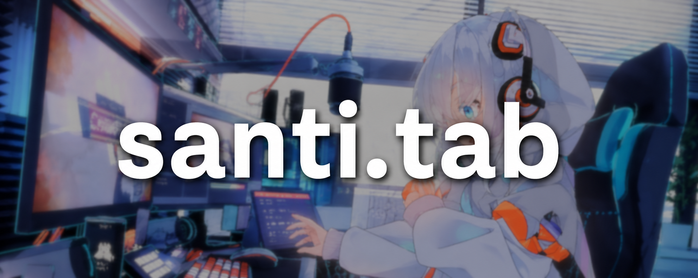
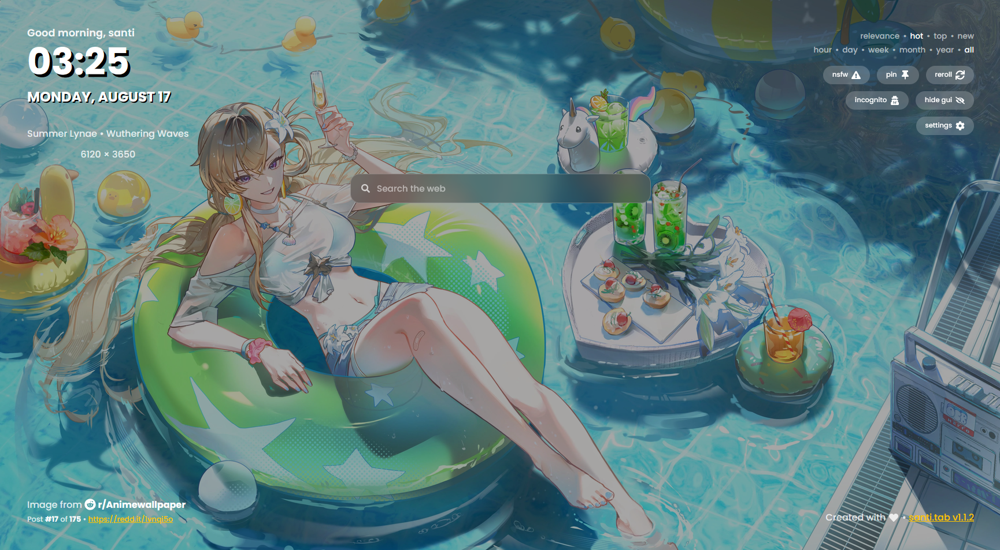
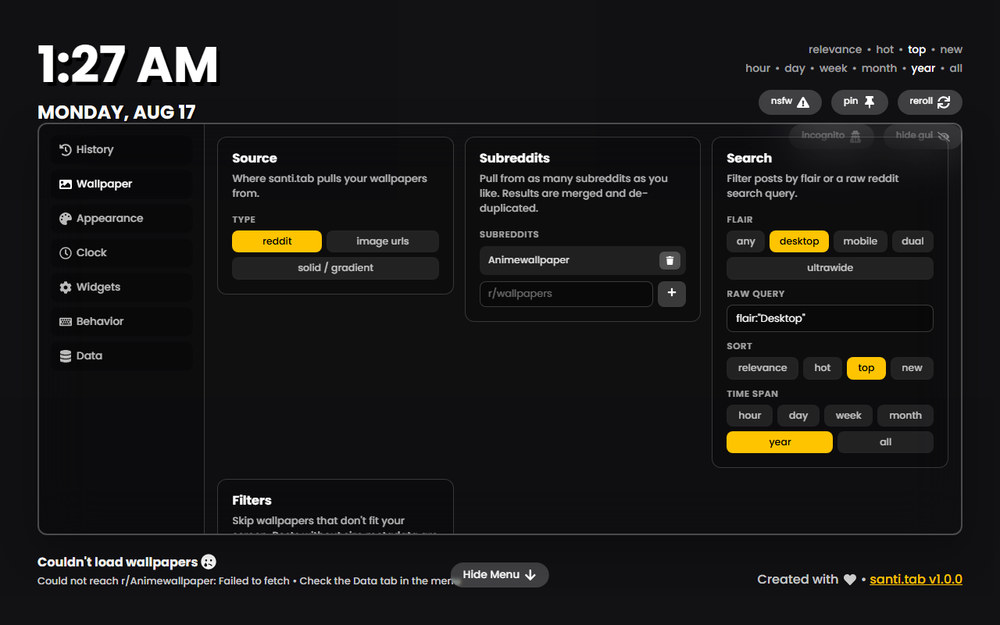
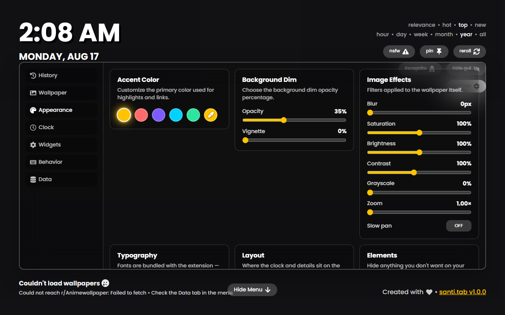
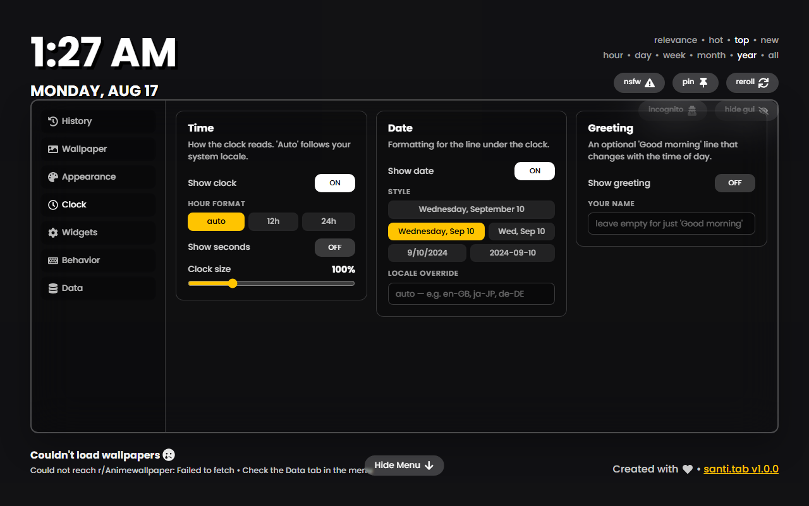
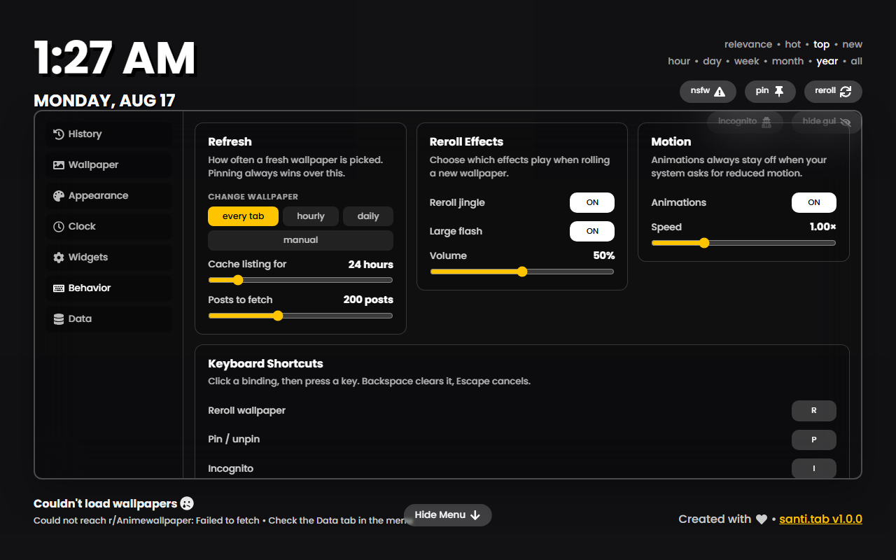

<div align="center">


# santi.tab

**A ridiculously customizable new tab page for Firefox *and* Chromium.**



[](https://github.com/dlyrr/santi.tab/actions/workflows/build.yml)
[](LICENSE)

</div>

santi.tab replaces your new tab with a full-bleed wallpaper and only the widgets
you actually want. Every colour, filter, font, position, shortcut and source is
yours to change, and if the settings panel still isn't enough, there's a custom
CSS box at the bottom of it.

A fork of [cf12/atarashii-tab](https://github.com/cf12/atarashii-tab), rebuilt
around a much larger settings system and a second browser target.



## Install

### Firefox

Install from **[addons.mozilla.org](https://addons.mozilla.org/firefox/addon/santi-tab/)**.

> Awaiting Mozilla review — that link goes live once it's approved. Until then,
> build from source and load it via `about:debugging#/runtime/this-firefox` →
> **Load Temporary Add-on** → pick `dist-firefox/manifest.json`. Temporary
> add-ons are removed when Firefox restarts; Firefox only installs an extension
> permanently if it's signed by Mozilla.

**Firefox needs one extra click.** Firefox treats Manifest V3 host permissions
as optional, so reddit access isn't granted at install and no wallpapers load.
Open **Menu → Data → Grant reddit.com access**. On Chromium that button never
appears, because there's nothing to grant.

### Chromium

Chrome, Edge, Brave, Arc, Vivaldi and Opera. Not on the Chrome Web Store, so
load it unpacked:

1. Download `santi.tab-chromium-<version>.zip` from the
   [latest release](https://github.com/dlyrr/santi.tab/releases/latest) and unzip it
2. Open `chrome://extensions` and turn on **Developer mode**
3. **Load unpacked** → select the unzipped folder

### From source

```bash
git clone https://github.com/dlyrr/santi.tab.git
cd santi.tab
npm install
npm run build:all      # -> dist/ (Chromium) and dist-firefox/ (Firefox)
```

Then load `dist/` or `dist-firefox/` using the steps above.

## What you can change

<table>
<tr><td width="50%" valign="top">

**Wallpaper source**
- Any number of subreddits, not just r/Animewallpaper
- Flair picker *and* a raw reddit search query
- Sort, time span, and a three-way NSFW mode (hide / include / only)
- Minimum size and orientation filters
- Your own image URLs — or no images at all, just a colour or gradient

**Appearance**
- Accent colour, background dim, vignette
- Blur, saturation, brightness, contrast, grayscale
- Zoom and a slow "Ken Burns" pan
- Five bundled fonts plus system stacks
- UI scale, corner radius, text shadow
- Nine clock positions and adjustable edge padding
- Per-element visibility for everything on the page
- A custom CSS box

</td><td width="50%" valign="top">

**Clock & date**
- 12h / 24h / auto, optional seconds
- Five date formats including ISO
- Locale override (`ja-JP`, `de-DE`, …)
- Optional time-of-day greeting

**Widgets**
- Search bar — 7 engines or a custom `%s` template
- Quick links with favicons and a monogram fallback

**Behavior**
- New wallpaper every tab, hourly, daily, or manual only
- Cache duration and how many posts to pull
- Reroll jingle, flash and volume
- Animation speed, respecting `prefers-reduced-motion`
- **Every keyboard shortcut is rebindable**

**Data**
- Export/import your whole setup as JSON
- Clear cache, clear history, reset everything

</td></tr>
</table>

Favourited wallpapers survive a history clear, and pinning one keeps it across
new tabs.

<details>
<summary><b>More screenshots</b></summary>

| | |
|---|---|
|  |  |
|  |  |

</details>

## Privacy

- Fonts are bundled, not fetched from Google
- Settings and history stay in `localStorage`; nothing is sent anywhere
- The only requests are: reddit for the listing, the image host for the
  wallpaper, and — only if you add shortcuts — each shortcut's own favicon
- Incognito mode fetches nothing at all

## Development

```bash
npm run dev            # vite dev server, runs as a normal web page
npm run dev:watch      # rebuild dist/ on change, for live extension reloading
npm test               # vitest, watch mode
npm run test:run       # single run
npm run lint           # eslint
npm run lint:ext       # validate the Firefox package with Mozilla's web-ext
npm run screenshots    # drive the built bundle in Chromium; fails on any error
```

Regenerating committed assets, only when you change them:

```bash
npm run fonts          # re-download the bundled woff2 subsets
npm run icons          # rasterize the logo into public/icons
```

### Layout

```
manifests/         chromium.json + firefox.json, merged with package.json at build
src/stores/        valtio stores; ConfigStore holds every setting + its defaults
src/components/    app chrome
  settings/        one file per settings tab
  ui/              shared controls (Toggle, Slider, Segmented, ListEditor, …)
src/utils/         fetching, theming, downloads, the cross-browser shim
scripts/           font, icon, packaging and signing helpers
```

`TARGET=firefox` swaps the manifest and output directory; everything else is
shared between the two builds.

Every setting lives in `DEFAULT_CONFIG` in
[`src/stores/ConfigStore.ts`](src/stores/ConfigStore.ts). Add a key there and a
control in the matching panel — `applyDefaults` back-fills it for anyone
upgrading, so existing configs never break.

### Releasing

```bash
npm run package        # both targets, zipped into web-ext-artifacts/
npm run sign           # unlisted: AMO signs it, you distribute the .xpi
npm run package:amo    # listed: unsigned zip + source zip for the store
```

AMO version numbers are unique **per add-on across both channels**, so a version
you've already run `npm run sign` on can't then be submitted to the store —
you'll get *"Version X already exists"*. Bump first, and run only one of the two
per version. Listed submissions also need the source archive, since the shipped
bundle is minified; reviewer build steps are `npm ci && npm run build:firefox`.

Pushing a tag builds both targets and publishes a GitHub release.

## Credits

- Forked from [Atarashii Tab Page](https://github.com/cf12/atarashii-tab) by
  [cf12](https://github.com/cf12) — MIT
- Default wallpapers come from [r/Animewallpaper](https://reddit.com/r/Animewallpaper);
  artwork belongs to its original artists
- Fonts: Poppins, Montserrat, Inter, Space Grotesk, JetBrains Mono (SIL OFL 1.1)

## Support

For support or inquiries, please contact **support@xocat.online**

## License

[MIT](LICENSE) — original copyright Brian Xiang, fork copyright xocat.
