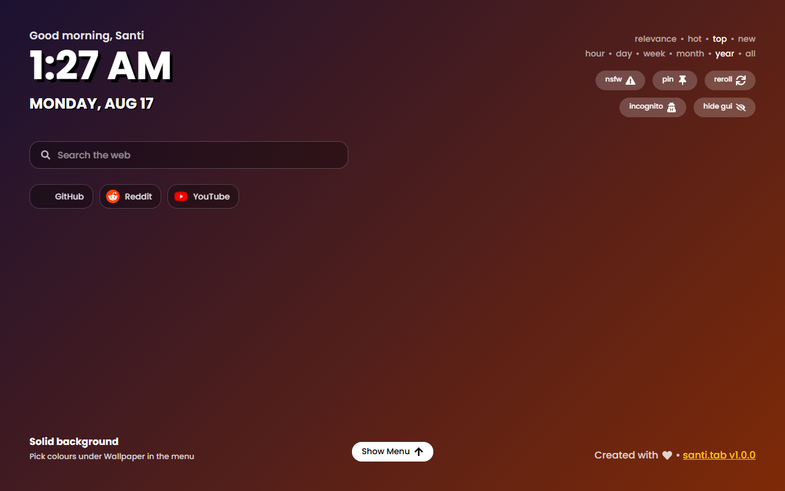

<div align="center">


# santi.tab

**A ridiculously customizable new tab page — for Chromium *and* Firefox.**

[](https://github.com/dlyrr/santi.tab/actions/workflows/build.yml)
[](LICENSE)

</div>

santi.tab replaces your new tab page with a full-bleed wallpaper and only the
widgets you actually want. Every colour, filter, font, position, shortcut, and
source is yours to change — and if the settings panel still isn't enough, there
is a custom CSS box at the bottom of it.

It is a fork of [cf12/atarashii-tab](https://github.com/cf12/atarashii-tab),
rebuilt around a much larger settings system and a second browser target.



<details>
<summary><b>The settings panel</b></summary>

| | |
|---|---|
|  |  |
|  |  |

</details>

---

## What you can change

<table>
<tr><td width="50%" valign="top">

**Wallpaper source**
- Any number of subreddits, not just r/Animewallpaper
- Flair picker *and* a raw reddit search query
- Sort, time span, and a three-way NSFW mode (hide / include / only)
- Minimum width, minimum height, and orientation filters
- Your own list of image URLs instead of reddit
- Or no images at all — a solid colour or a gradient

**Appearance**
- Accent colour (presets or a picker)
- Background dim and vignette
- Blur, saturation, brightness, contrast, grayscale
- Zoom and a slow "Ken Burns" pan
- Five bundled fonts plus system / serif stacks
- UI scale, corner radius, text shadow
- Layout: nine clock positions, adjustable edge padding
- Per-element visibility for everything on the page
- A custom CSS box

</td><td width="50%" valign="top">

**Clock & date**
- 12h / 24h / auto, optional seconds
- Five date formats including ISO
- Locale override (`ja-JP`, `de-DE`, …)
- Independent clock size
- Optional time-of-day greeting with your name

**Widgets**
- Search bar with 7 built-in engines or a custom `%s` template
- Quick-link shortcuts with favicons and a monogram fallback

**Behavior**
- New wallpaper every tab, hourly, daily, or manual only
- Listing cache duration and how many posts to pull
- Reroll jingle, flash, and volume
- Animation toggle and speed, respecting `prefers-reduced-motion`
- **Every keyboard shortcut is rebindable**

**Data**
- Export and import your whole setup as JSON
- Clear cache, clear history, reset everything

</td></tr>
</table>

Favourited wallpapers survive a history clear, and pinning a wallpaper keeps it
across new tabs.

## Install

### From a release

Grab the latest [release](https://github.com/dlyrr/santi.tab/releases):

- **Chromium** (Chrome, Edge, Brave, Arc, Vivaldi, Opera) — download
  `santi.tab-chromium.zip`, unzip it, open `chrome://extensions`, enable
  **Developer mode**, then **Load unpacked** and select the folder.
- **Firefox** — download `santi.tab-firefox.zip`, open `about:debugging#/runtime/this-firefox`,
  then **Load Temporary Add-on** and select the zip. For a permanent install,
  the add-on needs to be signed through [AMO](https://addons.mozilla.org/developers/).

### From source

```bash
git clone https://github.com/dlyrr/santi.tab.git
cd santi.tab
npm install
npm run build:all      # -> dist/ (Chromium) and dist-firefox/ (Firefox)
```

## A note for Firefox users

Firefox treats Manifest V3 host permissions as **optional** — they are not
granted at install time the way Chromium grants them. Until reddit.com access
is granted, wallpapers can't be fetched.

santi.tab detects this and shows a **Grant reddit.com access** button under
**Menu → Data**. One click and it works. (On Chromium the button never appears,
because there is nothing to grant.)

## Development

```bash
npm run dev            # vite dev server, runs as a normal web page
npm run dev:watch      # rebuild dist/ on change, for live extension reloading
npm test               # vitest, watch mode
npm run test:run       # single run
npm run lint
npm run lint:ext       # validate the Firefox package with Mozilla's web-ext
npm run package        # build both targets and zip them
npm run screenshots    # drive the built bundle in Chromium; fails on any error
```

Two generated asset steps, only needed when you change them:

```bash
npm run fonts          # re-download the bundled woff2 subsets
npm run icons          # rasterize marketing/icon.svg into public/icons
```

### Layout

```
manifests/         chromium.json + firefox.json, merged with package.json at build
src/stores/        valtio stores; ConfigStore holds every setting + its defaults
src/components/    App chrome
  settings/        one file per settings tab
  ui/              shared controls (Toggle, Slider, Segmented, ListEditor, ...)
src/utils/         fetching, theming, downloads, the cross-browser shim
scripts/           font + icon generators
```

`TARGET=firefox` swaps the manifest and the output directory; everything else
is shared between the two builds.

Settings live in `DEFAULT_CONFIG` in
[`src/stores/ConfigStore.ts`](src/stores/ConfigStore.ts). Adding a key there and
a control in the matching panel is all it takes — `applyDefaults` back-fills the
new key for anyone upgrading, so existing configs never break.

## Privacy

- Fonts are bundled, not fetched from Google.
- Settings and history stay in `localStorage`. Nothing is sent anywhere.
- The only network requests are to reddit for the listing, to the image host for
  the wallpaper, and — if you enable shortcuts — to each shortcut's own site for
  its favicon.
- Incognito mode fetches nothing at all.

## Credits

- Forked from [Atarashii Tab Page](https://github.com/cf12/atarashii-tab) by
  [cf12](https://github.com/cf12) — MIT.
- Default wallpapers come from [r/Animewallpaper](https://reddit.com/r/Animewallpaper);
  artwork belongs to its original artists.
- Fonts: Poppins, Montserrat, Inter, Space Grotesk, JetBrains Mono (SIL OFL 1.1).

## License

[MIT](LICENSE) — original copyright Brian Xiang, fork copyright xocat.
